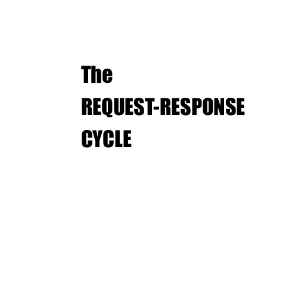
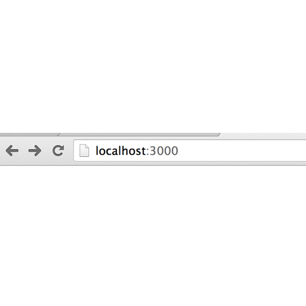

# Intro Express
## Bitly Clone

### Workflow & Submission

* Fork this repo onto your GitHub account.
* Clone the repo from your GitHub account onto your computer.
* Do your work in your local repo.
* `git add . -A` and `git commit -m "solution"`
* `git push origin master` to update your repo on GitHub.
* Submit a link to the `bitly_clone` reop on your GitHub account.


### Helpful Concepts

 

### Bitly Clone Spec

* A **user** can go to `localhost:3000` or the root route and see a `form` to submit a url.
* A **user** can submit a link to server using the form.
* A **user** should receive back a response with the url they can use to be redirected to the their submited url, i.e. something of the form  `localhost:3000/urls/:id`.
* A **user** should be able to to use the url they receive back from your server as a redirect url.


*User story: Program requirements written in terms of what a user should be able to do with the final product.*

## Notes

### Deliverables

You'll need the following routes:

* `GET /` to view a form
* `POST /urls` to submit a url to shorten
* `GET /urls/:id` to be redirected to a url

* When your **Express** server receives a url from the client, you should push it into an array.
* When your **Express** server responds, it should use the index of the url from the `urls` array as the `id`. For example, if I submit the first url, I should get back the following:
	
	```
	View your url at localhost:3000/urls/0
	
	```
* When your user goes to the `/urls/:id` route, you should look up the `:id` param in the `urls` array to find the associated url and then redirect to it.

## Getting Started
Wondering how to get started? This section will guide you through creating and setting up a simple example project. You can use the example project as a starting point for your app.

1. Make the required files and directories.

	```bash
	touch index.js
	mkdir views
	touch views/home.html
	echo 'node_modules' >> .gitignore
	npm init 
	npm install --save express
	```
  * The `index.js` file holds all of our main application logic. **It is the main file you'll work in for the rest of the lab.**
  * We'll use the `views/home.html` file later by sending it as one of our responses.
  * The `npm init` command asks some questions about your project, then automatically makes a `package.json` for you.
  * We're appending "node_modules" to our .gitignore file so that we don't upload that directory to our Github repository. 

2. Make sure to setup your application to require **Express**.
	
	```javascript
	var express = require("express");
	var app = express();
	```
3. Add your first simple route.

	```javascript
	app.get("/", function (req, res) {
		res.send("Hello World");
	});
	```
4. Make sure your application server is listening.

	```javascript
	app.listen(3000, function (req, res) {
		console.log("working!!")
	});
	```
5. By this point, you should have an `index.js` like the following:

	```javascript
	var express = require("express");
	var app = express();

	app.get("/", function (req, res) {
		res.send("Hello World");
	});

	app.listen(3000, function (req, res) {
		console.log("working!!")
	});
	```

### HINTS

Feeling stuck?  Each hint below should help you get one step closer to completing the lab. 


#### Hint 0: General hints   

* Each time you change your server, stop it and restart it.
* Make sure you check that each submited url starts with either `https://` or `http://`.


------
#### Hint 1: Responding with a file

**We want to send our `./views/home.html` file as our response when someone goes to **localhost:3000/**.**

	```
		 ./views/home.html
		/|\
		 |
	the dot means 
	current 
	working 
	directory
	or cwd
	```
  * We need to add some text to the `home.html` file

	```html
	<!DOCTYPE html>
	<html>
	<head>
	  <title>Bitly Clone</title>
	</head>
	<body>
	  Hello World
	</body>
	</html>
	```
  * Let's send that file back as a response. Modify your `app.get("/", ...)` route.

	```javascript
	app.get("/", function (req, res) {
		// note we are using `res.sendFile`
		res.sendFile(process.cwd() + "/views/home.html");
	});
	```
  * Test your app is running at `localhost:3000`. Do you see hello world?

	
**Quick Refactor**
	
Just concatenating strings that represent file paths is dangerous. Just imagine adding up:
	
	```javascript
	"/views/" + "/home.html"
	=> "/views//home.html"
	```
	
Because it would be tough for you to go in and properly remove all the extra `/` marks (or add them when missing), we will use a built in Node utility to do this for us: **path**. Add the following to the top of your application.
	
```javascript
var express = require("express");
var path = require("path"); // <-- add this

var app = express();

```

Then define a variable that is your `./views/` directory path.

```javascript
var express = require("express");
var path = require("path"); 

var app = express();
// a variable that represents "./views"
var views = path.join(process.cwd(), "views"); 

```
	
Now refactor your root `app.get` route to use the `views` variable.

```javascript
app.get("/", function (req, res) {
	var homePath = path.join(views, "home.html");
	res.sendFile(homePath);
});

```

-----

#### Hint 2: Adding a form

**We want to add a form to take in users' `urls`. **

```html

<form action="/urls" method="POST">
	<input type="text" name="url" placeholder="New Url">
	<button>Shorten URL</button>
</form>

```

**A Note About Forms**

Note that in the form above we have both an **action** and a **method**.

| form attribute | role |
| :--- | :--- |
| `action="/urls"` | tells it where to send the request on the server |
| `method="POST"` | tells the server what type of request is being made |


Remember there are some conventions for certain types of requests.

| Request Type | Role |
| :--- | :--- |
| `GET /puppies` or `GET /puppies/sparky`| the `GET` request just requests the information related to requested resource. Here we are requesting all information about `puppies` or the puppy with name `sparky`. |
| `POST /puppies` | A `POST` request is usually reserved for **creating something new** on a server. | 
| `PUT /puppies/sparky?name=sparkles` | A `PUT` request is usually reserved for some kind of **update** on the server. Here we might be trying to update the **puppy** with name **sparky** to have the name **sparkles** |
| `DELETE /puppies/sparky` | The **DELETE** type of request should remove something from the server. Here we are removing the puppy with name of **sparky**. |


If we submit the form from above, we will be making a `POST /urls` request, and we will also be sending form data in our request. 

* First we need to make sure our application can handle the form data being submitted.

	```bash
	npm install --save body-parser
	```
* Then we need to add `body-parser` to our require statements.

	```javascript
	var express = require("express");
	var path = require("path"); 
	var bodyParser = require("body-parser"); // <-- add this

	var app = express();
	app.use(bodyParser.urlencoded({extended: true}) // <-- add this

	// a variable that represents "./views"
	var views = path.join(process.cwd(), "views"); 


	```

* Now we need to set up our `app.post` route.

	```javascript
	app.post("/urls", function (req, res) {
		var newUrl = req.body.newUrl;
		res.send("Received " + newUrl);
	});
	```

-----
#### Hint 3: Saving URLS

** We want to keep track of our redirect urls. **

* In order to save a url, we need to add an array to store our `urls`.

	```javascript
	var express = require("express");
	var path = require("path"); 
	var bodyParser = require("body-parser"); 

	var app = express();
	app.use(bodyParser.urlencoded({extended: true});

	// a variable that represents "./views"
	var views = path.join(process.cwd(), "views"); 

	var urls = [];// <--- Add this variable for urls
	```

* Now update your `app.post` to push the `newUrl` from the form into the `urls` array.

	```javascript

	app.post("/urls", function (req, res) {
		var newUrl = req.body.newUrl;
		urls.push(newUrl);
		var index = urls.length - 1;
		res.send("View your url at localhost:3000/urls/" + index));
	});

	```

* We need to add a route so that `/urls/:index` takes us to our requested url.

	```javascript
	app.get("/urls/:index", function (req, res) {
		var url = urls[req.params.index];
		res.redirect(url);
	});
	```


### Bonus

Because using an array index doesn't obscure how we are looking up the submitted links, our site is vulnerable. Nothing is stopping someone from going through every index to see what links have been submitted.

```
   localhost:3000/urls/0
   localhost:3000/urls/1
   localhost:3000/urls/2
   ...
   localhost:3000/urls/99
```

* Use `npm` to install `secure-random`
	* `npm install --save randomstring`
	*  In the node repl verify the following behavior.
	
		```
		var RString = require("randomstring");
		RString.generate()
		// => "XwPp9xazJ0ku5CZnlmgAx2Dld8SHkAeT"
		
		```
* Get rid of your array and use an Object to store a random string associated to random string generated each time a url is submitted.
* Your server should now respond with the following:
	
		```
		Visit your url at localhost:3000/urls/XwPp9xazJ0ku5CZnlmgAx2Dld8SHkAeT
		```


